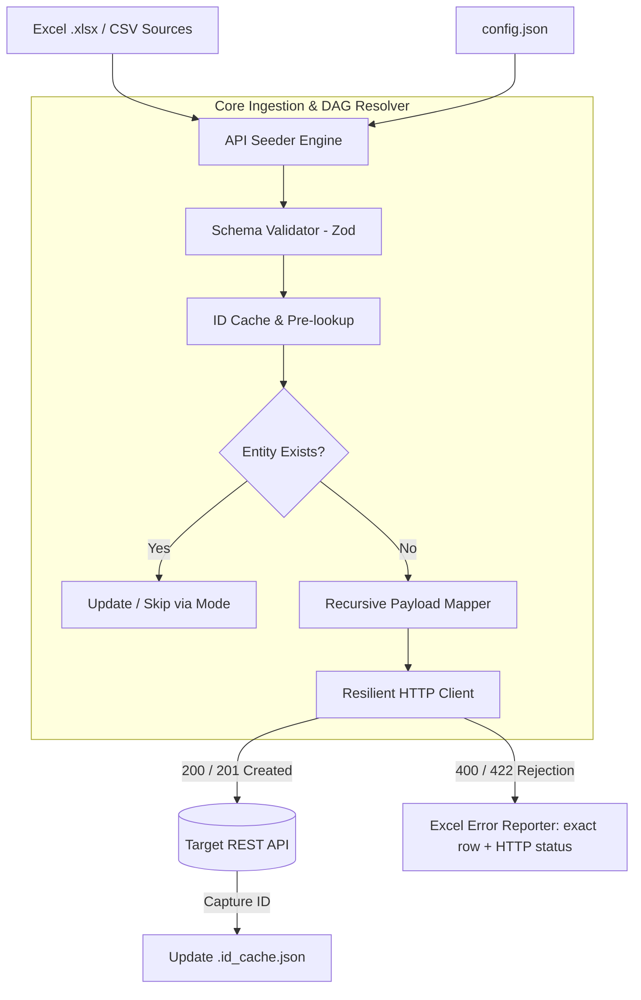

<div align="center">

# API Seeder

**Industrial hierarchical Excel & CSV data ingestion, validation, and seed orchestrator for REST APIs.**

[](https://www.npmjs.com/package/api-seeder)
[](https://www.typescriptlang.org)
[](https://nodejs.org)
[](https://modelcontextprotocol.io)
[](LICENSE)

[Overview](#overview) • [Key Features](#key-features) • [Architecture](#architecture--data-flow) • [Quickstart](#quickstart) • [CLI Commands](#command-line-interface-cli) • [Web Studio](#api-seeder-studio) • [AI & MCP](#ai--model-context-protocol-mcp) • [Configuration](#configuration-specification)

</div>

---

## Overview

In enterprise environments (ERP, EdTech, FinTech, GovTech, Cartography), operations and business teams routinely supply essential records through **Microsoft Excel (.xlsx)** or **CSV** files.

Writing ad-hoc ingestion scripts for every entity model introduces recurring operational risks:
* Complex parent-child dependency ordering (such as *Organizations* -> *Departments* -> *Employees*).
* Dynamic identifier resolution and cache synchronization across dependent steps.
* Idempotent pre-flight lookups to prevent duplicate resource creation.
* Granular row-by-row error reporting mapping server rejections back to source spreadsheet lines.

**API Seeder** standardizes this pipeline with a declarative, type-safe execution engine distributed as:
1. **Zero-install CLI**: `npx api-seeder`
2. **Local Web Studio**: `npx api-seeder studio` (browser-based GUI, no desktop binaries required)
3. **Model Context Protocol (MCP) Server**: autonomous tooling for AI agents.

---

## Key Features

* **High-Throughput Execution Engine**: Native TypeScript core built on `ExcelJS` and `PapaParse`, providing sub-second startup and streaming ingestion.
* **Hierarchical Dependency Graph (DAG)**: Automated capture and injection of IDs generated by upstream parent steps (`$ref:step.id` and `${step.id:col}`) into downstream child payloads.
* **Interactive Local Web Studio**: Embedded web interface accessible via `npx api-seeder studio` with real-time SSE execution logs, metrics, and live spreadsheet preview.
* **Declarative Template Generation**: Automatic generation of styled, pre-formatted Excel template workbooks inferred from the target configuration.
* **Row-Level Error Auditing**: Generates an `_errors.xlsx` audit file identifying exact source line numbers, payloads sent, HTTP status codes, and server rejection messages.
* **AI & MCP Native**: Integrated MCP server (`@api-seeder/mcp`) exposing tools for Claude Desktop, Cursor, Antigravity, and custom agent workflows.

---

## Architecture & Data Flow



---

## Quickstart

### 1. Initialize a project
```bash
npx api-seeder init
```
Launches an interactive setup wizard that produces a validated `config.json` with IDE schema support.

### 2. Generate blank Excel templates
```bash
npx api-seeder template config.json -o ./data
```

### 3. Validate configuration and file columns
```bash
npx api-seeder validate config.json
```

### 4. Run dry-run simulation (no network mutations)
```bash
npx api-seeder sync config.json --dry-run
```

### 5. Launch the Web Studio
```bash
npx api-seeder studio
```
Starts the local development server at `http://localhost:4000` with live execution logs and dataset inspection.

---

## Command-Line Interface (CLI)

| Command | Description | Options |
|---|---|---|
| `api-seeder sync [config]` | Execute data synchronization to target API | `--dry-run`, `--fail-fast`, `--cache-file <path>` |
| `api-seeder validate [config]` | Verify JSON Schema, file presence, and column mappings | None |
| `api-seeder template [config]` | Generate styled blank Excel templates from schema | `-o, --output <dir>` |
| `api-seeder studio` | Start local Web Studio server | `-p, --port <num>`, `-c, --config <path>` |
| `api-seeder init` | Interactive project configuration wizard | None |
| `api-seeder schema` | Export official `schema.json` for IDE autocompletion | `-o, --output <path>` |

---

## API Seeder Studio

API Seeder eliminates desktop executable packaging in favor of an instant local web environment:

```bash
npx api-seeder studio
```

Capabilities:
* **Dataset Explorer**: Real-time spreadsheet parsing and preview (headers and first 15 records).
* **Live Ingestion Stream**: Server-Sent Events (SSE) telemetry reporting status and errors per row.
* **Telemetry Metrics**: Immediate counts for created, updated, skipped, and rejected records.
* **Unified Frontend Foundation**: Architectural parity between local CLI execution and future cloud multi-tenant deployment.

---

## AI & Model Context Protocol (MCP)

API Seeder provides an official **Model Context Protocol (MCP)** server under `@api-seeder/mcp`.

Add this server to your Claude Desktop configuration (`claude_desktop_config.json`) or Cursor / Antigravity settings:

```json
{
  "mcpServers": {
    "api-seeder": {
      "command": "npx",
      "args": ["-y", "@api-seeder/mcp"]
    }
  }
}
```

### Available MCP Tools:
* `inspect_data_file`: Inspects an Excel or CSV file, returning column names, row counts, and data samples.
* `validate_seeder_config`: Validates a configuration file against the canonical Zod schema.
* `generate_excel_templates`: Generates empty template sheets inferred from configured steps.
* `run_seed_job`: Executes the seeding engine autonomously with `dryRun` and `failFast` flags.

---

## Configuration Specification

```json
{
  "$schema": "https://raw.githubusercontent.com/albertk-dev/api-seeder/main/schema.json",
  "api_base_url": "https://api.example.com/v1",
  "use_id_cache": true,
  "id_cache_file": ".id_cache.json",
  "global_headers": {
    "Authorization": "Bearer YOUR_API_TOKEN",
    "Content-Type": "application/json"
  },
  "integration_steps": [
    {
      "name": "create_organizations",
      "enabled": true,
      "source_file": "data/organizations.xlsx",
      "endpoint": "/organizations",
      "method": "POST",
      "unique_identifier": "code_org",
      "payload_mapping": {
        "name": "{{OrgName}}",
        "code": "code_org",
        "region": "Region"
      }
    },
    {
      "name": "create_departments",
      "enabled": true,
      "source_file": "data/departments.xlsx",
      "endpoint": "/departments",
      "method": "POST",
      "unique_identifier": "code_dept",
      "payload_mapping": {
        "department_name": "{{DeptName}}",
        "organization_id": "${create_organizations.id:code_org}"
      }
    }
  ]
}
```

---

## Monorepo Structure

```text
api-seeder/
├── packages/
│   ├── core/         # @api-seeder/core: Ingestion engine, resolver, cache, reporter
│   ├── cli/          # api-seeder: CLI binary and terminal interface
│   └── mcp/          # @api-seeder/mcp: AI Model Context Protocol server
├── examples/         # Complete runnable examples
│   └── school_management/
├── _archive/         # Legacy Python code preserved for reference
├── schema.json       # Exported JSON Schema
├── pnpm-workspace.yaml
└── package.json
```

---

## Author & Maintainer

* **Albert Kameni** — Software Engineer
* **GitHub**: [@albertk-dev](https://github.com/albertk-dev)
* **LinkedIn**: [albertk-linked](https://www.linkedin.com/in/albertk-linked)
* **Email**: [albertk.explorer@gmail.com](mailto:albertk.explorer@gmail.com)

---

## License

This project is licensed under the [MIT License](LICENSE).
