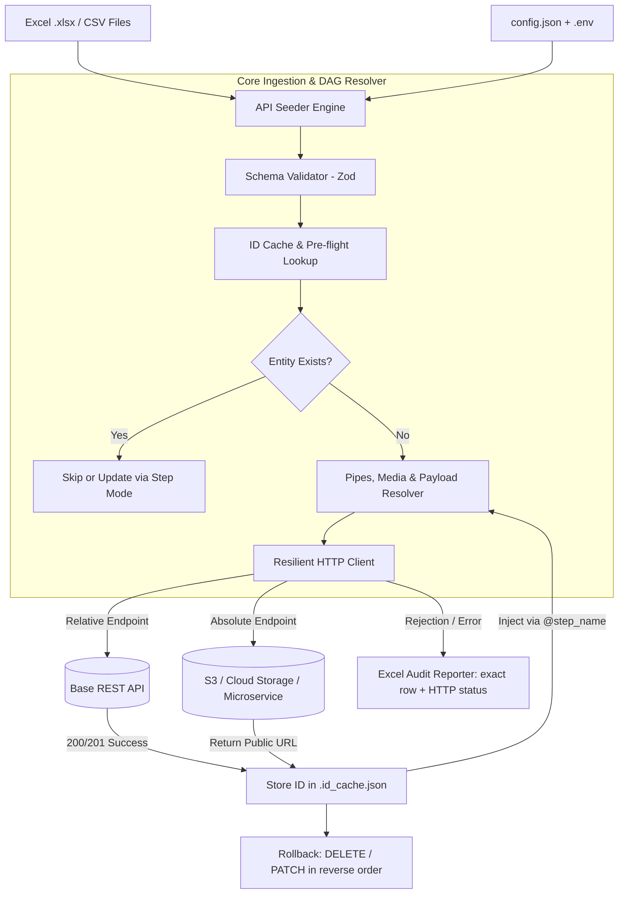

<div align="center">

# API Seeder

**Industrial Hierarchical Excel & CSV Data Ingestion, Validation, and Seed Orchestrator for REST APIs.**

[](https://www.npmjs.com/package/api-seeder)
[](https://www.typescriptlang.org)
[](https://nodejs.org)
[](https://modelcontextprotocol.io)
[](LICENSE)

[Overview](#overview) • [Key Features](#key-features) • [Architecture](#architecture--data-flow) • [Quickstart](#quickstart) • [Cloud Storage & S3 Uploads (Case C)](#cloud-storage--s3-uploads-case-c) • [Media & Asset Handling](#media--asset-handling) • [Transformers Catalog](#transformer-pipes-reference) • [Rollback Strategies](#transactional--soft-delete-rollback) • [Configuration Reference](#configuration-reference-manual) • [CLI Commands](#command-line-interface-cli) • [Web Studio](#api-seeder-studio) • [AI & MCP](#ai--model-context-protocol-mcp)

</div>

---

## Overview

In enterprise environments (ERP, EdTech, FinTech, GovTech, Logistics), operational and business teams frequently deliver domain records via **Microsoft Excel (.xlsx)** or **CSV** files.

Writing custom ad-hoc scripts for each data migration or operational import introduces major reliability risks:
* Complex parent-child dependency sequences (e.g. *Schools* -> *Grades* -> *Classes* -> *Students*).
* Broken relational foreign keys and lack of synchronized cross-step ID caching.
* Non-idempotent re-runs creating duplicate database records.
* Inability to handle local binary media (student photos, organization logos) or presigned cloud storage (AWS S3, MinIO, Google Cloud Storage).
* Lack of auditability when API validation rejects rows.

**API Seeder** solves this with a declarative, type-safe ingestion engine distributed as:
1. **Zero-install CLI**: `npx api-seeder`
2. **Local Web Studio**: `npx api-seeder studio` (responsive browser interface with desktop modal and mobile bottom-sheet)
3. **Model Context Protocol (MCP) Server**: native autonomous tooling for LLM coding agents.

---

## Key Features

* **High-Throughput Core**: Native TypeScript architecture built on `ExcelJS` and `PapaParse` with streaming parsing and configurable batching (`batch_size`).
* **Directed Acyclic Graph (DAG) Resolution**: Automatic capture of generated entity IDs (or URLs) from upstream steps and downstream injection using `@step_name(UniqueKeyColumn)`.
* **Autonomous External URLs (Case C)**: Endpoints starting with `http://` or `https://` bypass the global `api_base_url`, enabling dedicated microservices or S3 upload pipelines as standard DAG steps.
* **Multipart & Base64 Media Ingestion**: Direct upload of local files via `multipart/form-data` with `@file(path)` or inline Base64 data URIs via `{{ Photo | file_base64:'dir' }}`.
* **Configurable Status Codes (`expected_status`)**: Accept non-200 success codes (e.g. `201 Created`, `202 Accepted`) per step.
* **Granular Rollback Engine**: Revert runs cleanly in reverse DAG order. Supports hard deletes (`DELETE /:id`) and enterprise soft deletes (`PATCH /:id` with custom JSON archive payload), with per-step disable toggles.
* **Dynamic Transformer Pipes**: In-flight formatting (`{{ Col | trim | uppercase | date:'YYYY-MM-DD' | number }}`) and fallback defaults (`{{ Col || 'default' }}`).
* **Row-Level Error Auditing**: Automatically generates an `audit_errors_<timestamp>.xlsx` file documenting the exact source line, payload sent, HTTP status, and API error response.
* **Environment Variables**: Automatic resolution of `${env:VAR_NAME:-fallback}` and `.env` files.

---

## Architecture & Data Flow



---

## Quickstart

### 1. Initialize a Project
```bash
npx api-seeder init
```
Generates a validated `config.json` with IDE schema support.

### 2. Generate Empty Excel Templates
```bash
npx api-seeder template config.json -o ./data
```

### 3. Validate Configuration & File Columns
```bash
npx api-seeder validate config.json
```

### 4. Run Dry-Run Simulation (Zero Network Mutations)
```bash
npx api-seeder sync config.json --dry-run
```

### 5. Launch the Local Web Studio
```bash
npx api-seeder studio -c config.json
```
Opens `http://localhost:4000` with live SSE progress, dataset preview, and config inspector.

### 6. Transactional Rollback
```bash
npx api-seeder rollback config.json --dry-run
```

---

## Cloud Storage & S3 Uploads (Case C)

When ingesting entities that require files (e.g. school logos, student avatars, KYC identity documents), enterprise architectures frequently use a dedicated file upload service (or presigned AWS S3 / MinIO endpoint) that returns a public CDN URL. That URL is subsequently injected into the main entity payload.

In API Seeder, **this is treated as a standard integration step with an autonomous URL**.

### How It Works:
1. **Absolute URL Detection**: If `endpoint` begins with `http://` or `https://`, `ApiClient` uses that URL directly without prepending `api_base_url`.
2. **File Dispatch**: The step reads local files and sends them via `multipart/form-data`.
3. **URL Capture**: The step sets `response_id_field: "url"` and `unique_identifier: "Matricule"`. The returned CDN URL is stored directly in the cache.
4. **Downstream Injection**: The student creation step references the upload step using `@upload_photos_eleves(Matricule)`.

```json
{
  "integration_steps": [
    {
      "name": "upload_photos_eleves",
      "source_file": "data/eleves.csv",
      "endpoint": "https://storage.cloud-ecoles.cm/v1/uploads",
      "method": "POST",
      "content_type": "multipart/form-data",
      "expected_status": [200, 201],
      "unique_identifier": "Matricule",
      "response_id_field": "url",
      "payload_mapping": {
        "file": "@file(data/assets/photos/{{Photo}})",
        "folder": "students/avatars"
      },
      "rollback": {
        "enabled": false
      }
    },
    {
      "name": "eleves",
      "source_file": "data/eleves.csv",
      "endpoint": "/eleves",
      "method": "POST",
      "expected_status": 201,
      "unique_identifier": "Matricule",
      "payload_mapping": {
        "matricule": "Matricule",
        "nom_complet": "{{ NomComplet | trim }}",
        "classe_id": "@classes(CodeClasse)",
        "photo_url": "@upload_photos_eleves(Matricule)"
      }
    }
  ]
}
```

---

## Media & Asset Handling

API Seeder provides two complementary strategies for attaching binary files:

### Strategy 1: Native `multipart/form-data` with `@file(...)`
Use when the target API endpoint expects binary file uploads via standard HTTP form-data:
* Set `"content_type": "multipart/form-data"` on the step.
* Map file fields using `"file": "@file(path/to/{{ColumnName}})"`.
* API Seeder automatically detects MIME types (`.png`, `.jpg`, `.svg`, `.pdf`, etc.) and attaches a binary `Blob` with its original filename.

### Strategy 2: In-flight Base64 Encoding with `file_base64`
Use when the target API accepts a JSON payload with an embedded Base64 string:
* Use the transformer pipe: `"logo": "{{ LogoFile | file_base64:'data/assets/logos' }}"`.
* Produces a standard Data URI: `data:image/svg+xml;base64,PHN2Zy...`.
* Pass `'false'` as second argument if you only want the raw base64 string without data URI prefix: `{{ LogoFile | file_base64:'data/assets/logos':'false' }}`.

---

## Transformer Pipes Reference

Transformers are applied left-to-right inside `{{ Column | pipe1 | pipe2 }}` expressions.

| Transformer | Syntax Example | Input | Output | Description |
|---|---|---|---|---|
| `trim` | `{{ Name \| trim }}` | `"  Yaoundé  "` | `"Yaoundé"` | Removes leading and trailing whitespace |
| `uppercase` | `{{ Code \| uppercase }}` | `"cmr-01"` | `"CMR-01"` | Converts string to uppercase |
| `lowercase` | `{{ Email \| lowercase }}` | `"Admin@School.CM"` | `"admin@school.cm"` | Converts string to lowercase |
| `number` | `{{ Cap \| number }}` | `" 1 500,50 "` | `1500.5` | Cleans thousands separators and parses float |
| `boolean` | `{{ Active \| boolean }}` | `"oui"` / `"1"` / `"true"` | `true` | Evaluates truthy values |
| `default` | `{{ Cap \| default:'30' }}` | `""` or `null` | `"30"` | Fallback value if cell is empty |
| `date` | `{{ Birth \| date:'YYYY-MM-DD' }}` | Excel serial / ISO | `"2014-09-22"` | Formats dates with year/month/day patterns |
| `split` | `{{ Tags \| split:',' }}` | `"A, B, C"` | `["A", "B", "C"]` | Splits string into array of strings |
| `json` | `{{ Raw \| json }}` | `"{\"k\": 1}"` | `{"k": 1}` | Parses stringified JSON into object |
| `slug` | `{{ Title \| slug }}` | `"Lycée Leclerc !"` | `"lycee-leclerc"` | Strips accents and builds URL slug |
| `file_base64` | `{{ Logo \| file_base64:'dir' }}` | `"logo.svg"` | `"data:image/svg+xml;base64,..."` | Encodes local file to Base64 data URI |
| `file_exists` | `{{ File \| file_exists:'dir' }}` | `"photo.jpg"` | `true` / `false` | Checks if local file exists on disk |

### Shorthand Fallback Syntax
You can also use double pipes `||` for default values:
```text
{{ CapaciteMax || 30 }}
```

---

## Transactional & Soft-Delete Rollback

API Seeder records all created entity IDs in `.id_cache.json`. When rolling back, steps are executed in **reverse DAG order** to maintain referential integrity.

### Default Rollback: Hard Delete
If `rollback` is omitted, the engine automatically issues:
`DELETE <endpoint>/<entityId>`

### Enterprise Rollback: Soft Delete (PUT / PATCH with Payload)
Real-world enterprise systems rarely permit physical database deletions. Configure soft-delete behavior per step:

```json
{
  "name": "eleves",
  "endpoint": "/eleves",
  "rollback": {
    "enabled": true,
    "method": "PATCH",
    "endpoint": "/eleves/:id",
    "payload": {
      "statut": "ARCHIVED",
      "archived_by": "api-seeder-rollback"
    }
  }
}
```

### Disabling Rollback for Specific Steps
For upload steps (e.g. S3 uploads) where files should not be deleted if downstream steps fail:
```json
{
  "name": "upload_photos_eleves",
  "rollback": {
    "enabled": false
  }
}
```

---

## Configuration Reference Manual

### Root Configuration Keys

| Property | Type | Default | Description |
|---|---|---|---|
| `$schema` | `string` | Optional | Path or URL to `schema.json` for IDE autocompletion |
| `api_base_url` | `string` | **Required** | Base URL for REST API. Overridden if step endpoint is absolute |
| `use_id_cache` | `boolean` | `true` | Enable persisting ID cache to disk |
| `id_cache_file` | `string` | `".id_cache.json"` | Path to the JSON cache file |
| `global_headers` | `object` | `{"Content-Type": "application/json"}` | Global HTTP headers sent with every request |
| `lookups` | `object` | Optional | Shared pre-flight lookup configurations |
| `integration_steps` | `array` | **Required** | Ordered list of integration steps |

### Integration Step Keys

| Property | Type | Default | Description |
|---|---|---|---|
| `name` | `string` | **Required** | Unique step identifier used by `@name(key)` references |
| `enabled` | `boolean` | `true` | Toggle execution of this step |
| `source_file` | `string` | **Required** | Path to source `.xlsx` or `.csv` file |
| `endpoint` | `string` | **Required** | Target API endpoint (relative `/path` or absolute `https://...`) |
| `method` | `string` | `"POST"` | HTTP method (`GET`, `POST`, `PUT`, `PATCH`, `DELETE`) |
| `content_type` | `string` | `"application/json"` | Payload format: `"application/json"` or `"multipart/form-data"` |
| `expected_status` | `number \| number[]` | Any 2xx | Accepted HTTP status code(s) (e.g. `201` or `[200, 201]`) |
| `unique_identifier` | `string` | Optional | Source column used as unique key for caching IDs |
| `batch_size` | `number` | `1` | Batch size (`> 1` sends JSON array payload) |
| `response_id_field` | `string` | `"id"` | Key or dot path in response to extract ID (e.g. `"id"`, `"url"`, `"data.id"`) |
| `response_data_path` | `string` | Optional | Dot-notation path to root response object (e.g. `"data"` or `"result"`) |
| `mode` | `string` | `"sync"` | Ingestion mode: `"sync"`, `"create_only"`, or `"update_only"` |
| `payload_mapping` | `object` | Auto-mapped | Mapping definition. If omitted, all row columns are mapped 1:1 |
| `headers` | `object` | Optional | Step-specific HTTP headers |
| `rollback` | `object` | Optional | Custom rollback behavior configuration |

---

## Command-Line Interface (CLI)

```bash
# Data Synchronization
api-seeder sync [configPath] [--dry-run] [--fail-fast] [--cache-file <path>]

# Rollback Created Entities
api-seeder rollback [configPath] [--dry-run] [--force]

# Validate Config & Spreadsheets
api-seeder validate [configPath]

# Generate Excel Templates
api-seeder template [configPath] [-o <outputDir>]

# Launch Interactive Web Studio
api-seeder studio [-c <configPath>] [-p <port>] [--no-open]

# Export JSON Schema
api-seeder schema [-o <outputPath>]
```

---

## API Seeder Studio

Launch the embedded web interface:
```bash
npx api-seeder studio -c examples/school_management/config.json
```

* **Spreadsheet Data Grid**: Inspect parsed tables with column types and sample rows.
* **Execution Telemetry**: Live Server-Sent Events (SSE) streaming row results in real time.
* **Config Blueprint Inspector**: Responsive preview of the configuration with full modal support on desktop and bottom-sheet on mobile.
* **Zero Binary Overhead**: Runs on lightweight native Node.js HTTP server.

---

## AI & Model Context Protocol (MCP)

API Seeder includes an official MCP server for LLM tools:

```json
{
  "mcpServers": {
    "api-seeder": {
      "command": "npx",
      "args": ["-y", "@api-seeder/mcp"]
    }
  }
}
```

### Exposed MCP Tools:
* `inspect_data_file`: Analyzes any Excel or CSV file (headers, row counts, sample records).
* `validate_seeder_config`: Validates configuration structure against the official Zod schema.
* `generate_excel_templates`: Generates styled Excel template workbooks.
* `run_seed_job`: Runs the ingestion engine autonomously with dry-run and fail-fast flags.

---

## Monorepo Structure

```text
api-seeder/
├── packages/
│   ├── core/         # @api-seeder/core: Engine, DAG resolver, cache, transformers, HTTP client
│   ├── cli/          # api-seeder: CLI terminal interface and studio server
│   └── mcp/          # @api-seeder/mcp: Model Context Protocol AI tools
├── examples/         # Complete runnable examples
│   └── school_management/
│       ├── .env.example
│       ├── config.json
│       ├── data/
│       │   ├── etablissements.csv
│       │   ├── classes.csv
│       │   ├── eleves.csv
│       │   └── assets/
│       │       ├── logos/ (etab_01.svg, etab_02.svg)
│       │       └── photos/ (elv_001.svg, elv_002.svg, elv_003.svg)
├── schema.json       # Canonical JSON Schema v7
├── pnpm-workspace.yaml
└── package.json
```

---

## Author & Maintainer

* **Albert Kameni** — Software Engineer
* **GitHub**: [@albertk-dev](https://github.com/albertk-dev)
* **LinkedIn**: [albertk-linked](https://www.linkedin.com/in/albertk-linked)
* **Email**: [albertk.explorer@gmail.com](mailto:albertk.explorer@gmail.com)

---

## License

This project is licensed under the [MIT License](LICENSE).
