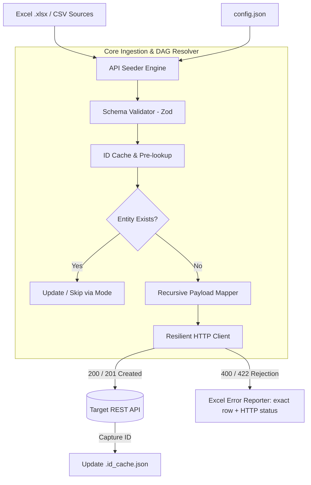

<div align="center">

# ⚡ API Seeder

**Industrial hierarchical Excel & CSV data ingestion, validation, and seed orchestrator for REST APIs.**

[](https://www.npmjs.com/package/api-seeder)
[](https://www.typescriptlang.org)
[](https://nodejs.org)
[](https://modelcontextprotocol.io)
[](LICENSE)

[Features](#-key-features) • [Quickstart](#-quickstart-in-30-seconds) • [CLI Commands](#-cli-commands) • [Web Studio](#-api-seeder-studio) • [AI & MCP Integration](#-ai--mcp-server) • [Config Specification](#-configuration-reference)

</div>

---

## 📌 Why API Seeder?

In many real-world enterprise applications (ERP, EdTech, FinTech, GovTech, Cartography), non-technical business teams provide critical data in **Microsoft Excel (.xlsx)** or **CSV** files. 

Manually writing one-off ingestion scripts for every data model is slow, error-prone, and doesn't handle:
* **Hierarchical parent-child relationships** (e.g. *Schools* ➜ *Classes* ➜ *Students*).
* **ID Resolution & Caching** between dependent steps.
* **Idempotence & Anti-Duplicate Checking** before inserting.
* **Row-by-Row Error Auditing** with exact Excel line numbers and server response codes.

**API Seeder** replaces custom ad-hoc scripts with a **declarative, type-safe, and blazing fast engine** available as:
1. **A zero-install CLI**: `npx api-seeder`
2. **A local Web Studio (like Prisma Studio)**: `npx api-seeder studio`
3. **An AI Model Context Protocol (MCP) server**: for autonomous AI agents.

---

## 🚀 Key Features

* ⚡ **Blazing Fast (<100ms startup)** : 100% pure TypeScript powered by `ExcelJS` and `PapaParse`.
* 🔗 **Hierarchical Graph Resolution** : Inject IDs generated by parent steps (`$ref:step.id` or `${step.id:col}`) into child entity payloads.
* 🖥️ **Interactive Web Studio** : Run `npx api-seeder studio` to visualize data, inspect mappings, and monitor live streaming sync in your browser.
* 🛠️ **Automatic Template Generator** : Generate ready-to-use blank Excel sheets with typed headers directly from your configuration.
* 📋 **Surgical Audit Reports** : Produces a styled `_errors.xlsx` audit file pinpointing the exact Excel row number, payload sent, and API rejection message.
* 🤖 **AI & MCP Ready** : Native MCP server (`@api-seeder/mcp`) so AI agents (Claude, Cursor, Antigravity) can inspect data and trigger seed jobs autonomously.

---

## 🧩 Architecture & Flow



---

## ⏱️ Quickstart in 30 Seconds

### 1. Initialize a new project
```bash
npx api-seeder init
```
This launches an interactive wizard that creates your `config.json` with JSON Schema support.

### 2. Generate blank Excel templates for your team
```bash
npx api-seeder template config.json -o ./data
```

### 3. Validate configuration & columns
```bash
npx api-seeder validate config.json
```

### 4. Test run with Dry-Run mode (zero network calls)
```bash
npx api-seeder sync config.json --dry-run
```

### 5. Launch the Web Studio
```bash
npx api-seeder studio
```
Opens a modern local web dashboard at `http://localhost:4000` with real-time SSE execution logs!

---

## 💻 CLI Commands

| Command | Description | Options |
|---|---|---|
| `api-seeder sync [config]` | Run full synchronization to target API | `--dry-run`, `--fail-fast`, `--cache-file <path>` |
| `api-seeder validate [config]` | Verify JSON Schema, file existence & columns | None |
| `api-seeder template [config]` | Generate blank styled Excel workbooks | `-o, --output <dir>` |
| `api-seeder studio` | Start local Web Studio (Prisma Studio style) | `-p, --port <num>`, `-c, --config <path>` |
| `api-seeder init` | Interactive project setup wizard | None |
| `api-seeder schema` | Export official `schema.json` for VS Code | `-o, --output <path>` |

---

## 🖥️ API Seeder Studio

No need to install bulky desktop `.exe` files! Just run:
```bash
npx api-seeder studio
```
Features:
* **Interactive Step Explorer** : Click any step to inspect its source Excel/CSV file with a live 15-row data preview.
* **Real-time Live Sync** : Stream progress row-by-row via Server-Sent Events (SSE).
* **Metrics Dashboard** : Live counters for created, updated, and failed entities.

---

## 🤖 AI & MCP Server

API Seeder provides an official **Model Context Protocol (MCP)** server under `@api-seeder/mcp`.

Add this to your Claude Desktop (`claude_desktop_config.json`) or Cursor / Antigravity settings:

```json
{
  "mcpServers": {
    "api-seeder": {
      "command": "npx",
      "args": ["-y", "@api-seeder/mcp"]
    }
  }
}
```

### Available MCP Tools for AI Agents:
* `inspect_data_file` : Analyzes an Excel/CSV file, returning column names, row counts, and sample data.
* `validate_seeder_config` : Validates a `config.json` against the Zod schema.
* `generate_excel_templates` : Creates template workbooks.
* `run_seed_job` : Runs the seeding engine autonomously with `dryRun` and `failFast` support.

---

## ⚙️ Configuration Reference (`config.json`)

```json
{
  "$schema": "https://raw.githubusercontent.com/albertk-dev/api-seeder/main/schema.json",
  "api_base_url": "https://api.my-domain.com/v1",
  "use_id_cache": true,
  "id_cache_file": ".id_cache.json",
  "global_headers": {
    "Authorization": "Bearer YOUR_SECRET_TOKEN",
    "Content-Type": "application/json"
  },
  "integration_steps": [
    {
      "name": "create_schools",
      "enabled": true,
      "source_file": "data/schools.xlsx",
      "endpoint": "/schools",
      "method": "POST",
      "unique_identifier": "code_etab",
      "payload_mapping": {
        "name": "{{SchoolName}}",
        "code": "code_etab",
        "city": "City"
      }
    },
    {
      "name": "create_classes",
      "enabled": true,
      "source_file": "data/classes.xlsx",
      "endpoint": "/classes",
      "method": "POST",
      "unique_identifier": "code_classe",
      "payload_mapping": {
        "title": "{{ClassName}}",
        "schoolId": "${create_schools.id:code_etab}"
      }
    }
  ]
}
```

---

## 📦 Monorepo Structure

```text
api-seeder/
├── packages/
│   ├── core/         # @api-seeder/core : Pure TS engine (Zod, ExcelJS, HTTP, DAG)
│   ├── cli/          # api-seeder : Official NPM CLI package
│   └── mcp/          # @api-seeder/mcp : AI Model Context Protocol server
├── examples/         # Real-world ready-to-run examples
│   └── school_management/
├── _archive/         # Archived legacy Python code for reference
├── schema.json       # Exported JSON Schema
├── pnpm-workspace.yaml
└── package.json
```

---

## 👤 Author & Community

* **Albert Kameni** (*"Le débogueur"*) — Software Engineer
* **GitHub**: [@albertk-dev](https://github.com/albertk-dev)
* **LinkedIn**: [albertk-linked](https://www.linkedin.com/in/albertk-linked)
* **Email**: [albertk.explorer@gmail.com](mailto:albertk.explorer@gmail.com)

---

## 📄 License

This project is licensed under the [MIT License](LICENSE).
