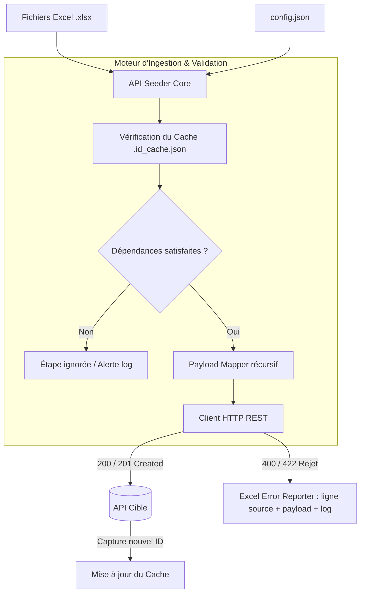

<div align="center">

# ⚡ API Seeder

**Moteur CLI d'ingestion, de synchronisation et de seeding de données Excel vers API REST avec résolution de dépendances hiérarchiques.**

[](https://python.org)
[](LICENSE)
[]()
[]()

[Fonctionnalités](#-fonctionnalités-clés) • [Architecture](#-architecture--flux-de-données) • [Installation](#-installation--démarrage-rapide) • [Utilisation CLI](#-guide-dutilisation-cli) • [Spécification Config](#-spécification-du-fichier-configjson)

</div>

---

## 📌 Présentation

**API Seeder** est un outil en ligne de commande (CLI) industriel conçu pour automatiser l'intégration, la migration et la synchronisation de données structurées (fichiers Microsoft Excel `.xlsx`) vers des APIs Web RESTful.

Contrairement aux scripts de seeding basiques, API Seeder intègre un **graphe de résolution de dépendances parent-enfant**, un **mécanisme de cache d'identifiants persistant**, un **rapport d'erreurs chirurgical par ligne Excel**, et un **générateur automatique de gabarits**.

---

## 🚀 Fonctionnalités Clés

* 🔄 **Synchronisation & Idempotence** : Évite les doublons en effectuant un pré-lookup des entités existantes avant création, gérant intelligemment les statuts `409 Conflict`.
* 🔗 **Résolution Hiérarchique de Dépendances** : Capture automatiquement les IDs générés par une entité parente (ex: `Etablissement`) pour les injecter dans les entités enfants (ex: `Classes`, `Eleves`), même entre plusieurs sessions d'exécution via le cache `.id_cache.json`.
* 📋 **Rapport d'Erreurs par Ligne Source** : En cas de rejet par l'API cible (validation 400/422), un fichier Excel d'audit est généré indiquant la **ligne exacte du fichier source** et le message d'erreur retourné par le serveur.
* 🛠️ **Générateur de Gabarits (Template Engine)** : Génère automatiquement l'arborescence complète des dossiers et les fichiers Excel vierges avec colonnes typées à partir de la configuration JSON.
* ⚡ **Mode Fail-Fast & Lookups à la Volée** : Permet soit d'arrêter net au premier incident (`--fail-fast`), soit de continuer l'ingestion avec rapport post-mortem.

---

## 🧩 Architecture & Flux de Données



---

## 📦 Installation & Démarrage Rapide

### Option A : Installation en tant que développeur (Recommandé)

```bash
# 1. Cloner le repository
git clone https://github.com/albertk-dev/api-seeder.git
cd api-seeder

# 2. Créer et activer l'environnement virtuel
python -m venv venv

# Sur Linux / macOS :
source venv/bin/activate
# Sur Windows (PowerShell) :
.\venv\Scripts\activate

# 3. Installer le package en mode éditable
pip install -e .
```

### Option B : Utilisation de l'exécutable autonome (Standalone)

Téléchargez la version binaire précompilée dans les [Releases](https://github.com/albertk-dev/api-seeder/releases) (ne requiert pas Python installé).

---

## 💻 Guide d'Utilisation CLI

La commande `api-seeder` expose deux sous-commandes principales :

```bash
api-seeder --help
```

### 1. Synchroniser les données (`sync`)

Lance l'ingestion séquentielle des étapes définies dans votre configuration.

```bash
# Exécution standard
api-seeder sync chemin/vers/config.json

# Exécution avec interruption immédiate à la première erreur (Fail-Fast)
api-seeder sync chemin/vers/config.json --fail-fast
```

### 2. Générer les modèles Excel (`template`)

Analyse votre `config.json` et crée l'arborescence des fichiers Excel prêts à être remplis par les équipes métier.

```bash
# Génération dans le dossier par défaut (./templates_excel)
api-seeder template chemin/vers/config.json

# Spécification d'un dossier de sortie personnalisé
api-seeder template chemin/vers/config.json -o ./mes_templates
```

---

## ⚙️ Spécification du fichier `config.json`

Voici un extrait type illustrant la résolution d'IDs parents vers enfants :

```json
{
  "api_base_url": "https://api.votre-service.com/v1",
  "use_id_cache": true,
  "global_headers": {
    "Authorization": "Bearer VOTRE_TOKEN_API",
    "Content-Type": "application/json"
  },
  "integration_steps": [
    {
      "name": "creation_etablissements",
      "enabled": true,
      "source_file": "data/etablissements.xlsx",
      "endpoint": "/etablissements",
      "method": "POST",
      "unique_identifier": "code_etablissement",
      "payload_mapping": {
        "nom": "{{Nom}}",
        "code": "{{Code}}"
      }
    },
    {
      "name": "creation_classes",
      "enabled": true,
      "source_file": "data/classes.xlsx",
      "endpoint": "/classes",
      "method": "POST",
      "payload_mapping": {
        "nom_classe": "{{Nom}}",
        "etablissement_id": "$ref:creation_etablissements.id"
      }
    }
  ]
}
```

---

## 📂 Structure Modulaire du Code

```text
api-seeder/
├── docs/                     # Guides de configuration et spécifications
├── examples/                 # Jeux de données d'exemple complets
├── src/
│   └── api_seeder/
│       ├── __init__.py
│       ├── main.py           # Point d'entrée CLI et parseur d'arguments
│       ├── core.py           # Moteur principal d'exécution d'étape
│       ├── payload.py        # Mappeur et injecteur dynamique de variables
│       ├── cache.py          # Gestionnaire de cache persistant des identifiants
│       ├── api_client.py     # Wrapper HTTP (Requests) résilient
│       ├── generator.py      # Moteur de génération de templates Excel
│       └── logger.py         # Formatage unifié des logs console
├── pyproject.toml            # Définition du projet et dépendances PEP 621
├── run.py                    # Script lanceur pour PyInstaller
└── README.md
```

---

## 🔨 Packaging de l'Exécutable (PyInstaller)

Pour distribuer l'outil sous forme d'exécutable binaire unique sans dépendance Python externe :

```bash
pip install pyinstaller
pyinstaller --name API-Seeder --onefile --console \
  --add-data "src/api_seeder;api_seeder" \
  --hidden-import "pandas" \
  --hidden-import "requests" \
  --hidden-import "openpyxl" \
  run.py
```

L'exécutable optimisé est généré dans le dossier `dist/`.

---

## 👤 Auteur & Contact

* **Albert Kameni** (*"Le débogueur"*) — Software Engineer
* **GitHub** : [@albertk-dev](https://github.com/albertk-dev)
* **LinkedIn** : [albertk-linked](https://www.linkedin.com/in/albertk-linked)
* **Email** : [albertk.explorer@gmail.com](mailto:albertk.explorer@gmail.com)

---
*Projet sous licence MIT.*
